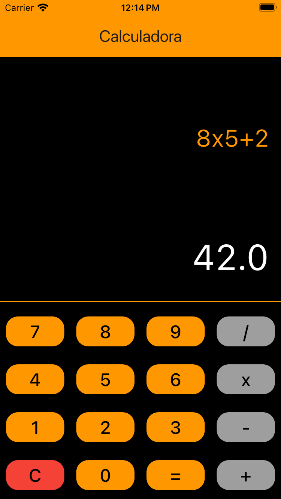
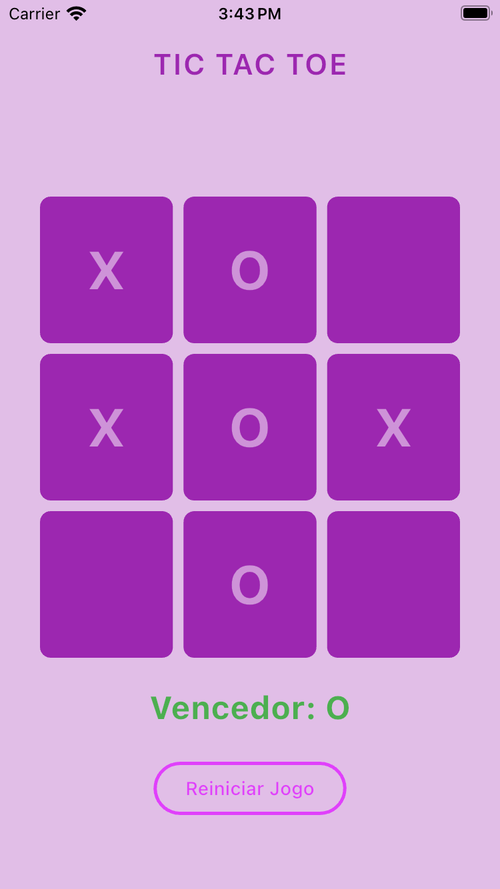

# Projeto Flutter - Talento Tech Paraná

Este é um projeto desenvolvido como parte obrigatória do programa **Talento Tech Paraná**. Ele é composto por diversas aplicações e atividades para mobile e web, cada uma organizada em uma pasta própria. O projeto explora funcionalidades e conceitos fundamentais do Flutter, incluindo:

- **Calculadora**: Uma calculadora funcional com operações básicas. [Acesse a branch aqui](https://github.com/CamilaFernandesdev/talentotech_atividades_flutter/tree/calculator) ou [a pasta aqui](calculadora/).
- **Jogo da Velha**: Uma versão digital do clássico jogo da velha. [Acesse a branch aqui](https://github.com/CamilaFernandesdev/talentotech_atividades_flutter/tree/tictactoe) ou [a pasta aqui](jogo_da_velha/).


## Imagens das Telas

| Calculadora                          | Jogo da Velha                       | Outras Atividades                   |
|--------------------------------------|-------------------------------------|-------------------------------------|
|  |  | Em breve |


## Estrutura do Projeto

O projeto está organizado da seguinte forma:

```plaintext
talentotech_atividades_flutter/
|-- calculadora/
|   |-- lib/
|-- jogo_da_velha/
|   |-- lib/
|-- assets/

```

- **calculadora/**: Contém o código-fonte e recursos da aplicação de calculadora.
- **jogo_da_velha/**: Contém o código-fonte e recursos do jogo da velha.
- **assets/**: Pasta centralizada para recursos compartilhados, como imagens.

---
## Novas Features e Melhorias

- **Organização do Código**: Planeja-se separar melhor a lógica de negócios (camada de backend) da interface com o usuário (view), seguindo os princípios de boas práticas de desenvolvimento em Flutter.
- **Branches Separadas**: Cada atividade possui sua própria branch, facilitando a colaboração e o versionamento.
- **Componentização**: Há planos de criar componentes reutilizáveis para interfaces consistentes.

---
## Como Executar o Projeto

1. Certifique-se de ter o Flutter instalado. Para mais informações, consulte a [documentação oficial do Flutter](https://flutter.dev/docs/get-started/install).
2. Clone este repositório:

   ```bash
   git clone https://github.com/CamilaFernandesdev/talentotech_atividades_flutter.git
   ```

3. Navegue até a pasta do projeto:

   ```bash
   cd nome_da_atividade
   ```

4. Instale as dependências:

   ```bash
   flutter pub get
   ```

5. Execute o projeto:

   ```bash
   flutter run
   ```

---

## Contribuições

Fique à vontade para enviar *issues* ou abrir *pull requests*. Toda contribuição é bem-vinda!

## Licença

Este projeto está licenciado sob a [MIT License](LICENSE).

---

### Desenvolvido por
**[Camila Fernandes]** - Participante do Talento Tech Paraná.


